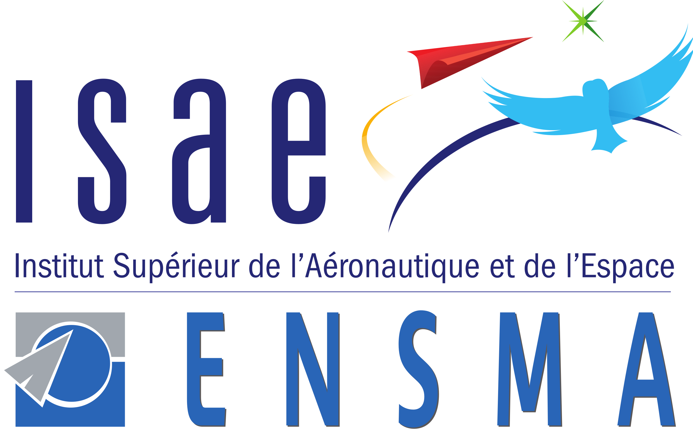

---
author:
- |
  BELPOIS Vincent\
  Under the supervision of Dr. Ivan [Mutis]{.smallcaps}
bibliography:
- refs.bib
date: 2024
title: |
  Final year project report\
  \*\*\*\*\*\*\*\*\*\*\*\*\*\*\*\*\*\*\*\*\*\*\*\*\*\*\*\*\*\*\*\*\*\*\*\*\*\*\*\*\*\*\*\*\*\*\*\*\*\
  Multi agent scene exploration and mapping\
  for civil engineering progress tracking\
  \*\*\*\*\*\*\*\*\*\*\*\*\*\*\*\*\*\*\*\*\*\*\*\*\*\*\*\*\*\*\*\*\*\*\*\*\*\*\*\*\*\*\*\*\*\*\*\*\*
---

{width="6cm"}

{width="8cm"}

Acknowledgments {#acknowledgments .unnumbered}
===============

Acknowledgments.

Introduction
============

Introduction

[@xu2022fast]

Setting up the physical agents {#section:big title}
==============================

Three platforms were used in this project, a six wheeled platform, a
quadcopter and a quadruped platform. Each platform was chosen for its
specific characteristics and the goal was to have a multi agent system
that could explore a scene and map it. The six wheeled platform was
chosen for its stability and its ability to carry heavy loads. The
quadcopter was chosen for its ability to fly and to have a bird's eye
view of the scene. The quadruped platform was chosen for its ability to
climb stairs and to have a low center of gravity.

Six wheeled platform setup
--------------------------

The six wheeled platform was chosen for its stability and its ability to
carry heavy loads, the intent was to have it carrying a robotic arm for
other projects. Some previous work was already done on the platform but
were apparently unsuccessful. These earlier attempts had left the
platform in a partially modified state, requiring a comprehensive
reassessment and redesign of both the mechanical and electrical systems.
Despite these setbacks, the robust chassis of the six-wheeled platform
still presented an excellent foundation for our project, offering the
potential for a versatile and capable vehicle once properly configured.

### Mechanical modifications

As it arrived, the six wheeled platform only consisted of a stainless
steel chassis and 6 DC motors and wheels. The platform required several
mechanical modifications to accommodate the necessary components for
autonomous operation. Specifically, it needed a mount for a Lidar sensor
and an embedded computer on its top surface
[\[fig:lidar\_mount\]](#fig:lidar_mount){reference-type="ref"
reference="fig:lidar_mount"}. Additionally, a mounting solution for the
motor drivers on the inside of the chassis was essential
[\[fig:motor\_driver\_mount\]](#fig:motor_driver_mount){reference-type="ref"
reference="fig:motor_driver_mount"}. These modifications were designed
and implemented to ensure proper integration of all components while
maintaining the structural integrity of the platform
[\[fig:full\_cad\_model\]](#fig:full_cad_model){reference-type="ref"
reference="fig:full_cad_model"}.

LIDAR MOUNT CAD

MOTOR DRIVER MOUNT CAD

FULL PLATFORM CAD

### Electronics architecture

The essential electronic components needed to get the platform running
were mainly DC motor drivers to drive the motors, a Lidar sensor and an
embedded computer.

Difficulties were encountered when trying to use the drivers someone
else tried before hand as they were underpowered : at stall, the motors
required around 5 amps, as measured with a bench top power supply, and
the drivers I was trying to use were only capable of delivering 2 amps
per channel or a total of 4 amps when combining outputs. The drivers in
question were the INSERT REFERENCE which were in terms replaced by the
driver INSERT REFERENCE . A physical comparison can be seen in
[\[fig:drivers\_compraison\]](#fig:drivers_compraison){reference-type="ref"
reference="fig:drivers_compraison"}

Difficulties were encountered when trying to use the drivers someone
else tried before hand as they were underpowered : at stall, the motors
required around 5 amps, as measured with a bench top power supply, and
the drivers I was trying to use were only capable of delivering 2 amps
per channel or a total of 4 amps when combining outputs. The drivers in
question were the L298N H-bridge motor drivers, which were ultimately
replaced by the DFRobot 7A Dual DC Motor Driver. The L298N drivers,
while popular for smaller projects, proved inadequate for the power
requirements of our six-wheeled platform. In contrast, the DFRobot 7A
Dual DC Motor Driver offer a continuous current output of 7A per
channel, more than sufficient for our needs. This upgrade significantly
improved the platform's performance, allowing for smoother operation and
better handling of the motor's power demands. A physical comparison of
these drivers can be seen in
Figure.[\[fig:drivers\_comparison\]](#fig:drivers_comparison){reference-type="ref"
reference="fig:drivers_comparison"}.

INSERT (a) (b) PICTURE OF BOTH DRIVERS

The three motor drivers were connected to microcontroller. The
connection can be seen in
[\[fig:driver\_to\_pico\]](#fig:driver_to_pico){reference-type="ref"
reference="fig:driver_to_pico"}. I chose to use a Raspberry pi Pico
microcontroller for it's many outputs at a total of XX general purpose
input outputs (GPIO) . Each driver required 6 control signals or 3 per
motor : Two signals are used to control the direction of the motor
according to table MAKE AND CITE TABLE DIR while the third signal's duty
cycle determine the speed.

A radio control (RC) receiver was also connected to interrupt capable
GPIOs of the microcontroller to be able to control the platform
manually. Three channels of the RC receiver were used to control the
speed, the direction and the mode of the platform. The mode refers to
whether or not the platform is in manual control or in autonomous mode
and is connected to channel 5 of the radio which has a two way switch.

Finally, the pico is connected to an Nvidia Jetson Orin single board
computer (SBC) via USB. This connection is used both to reprogram the
pico, as well as to send speed and direction commands to each motor via
a serial communication.

Not including the power distribution and regulation system,
[1](#fig:overall_electical_system){reference-type="ref"
reference="fig:overall_electical_system"} shows the electrical
connections of these components on the modified six-wheeled platform.

{#fig:overall_electical_system
width="80%"}

Driver to PICO connection diagram
[\[fig:driver\_to\_pico\]]{#fig:driver_to_pico
label="fig:driver_to_pico"}

### Software architecture

How the software on the jetson communicates with the microcontroller and
how it communicates with the lidar. The choice of the odometry algorithm
will be explain in another section (master, comparison of multiple algo)

The robot operation system (ROS) was chosen as the software framework
for the platform running on the Jetson Orin embedded computer.
Specifically, ROS2 Humble Hawksbill was selected due to its extensive
package availability and compatibility with the Jetson Orin's hardware.
Indeed, as I as made aware of the strugles of someone else running a ROS
based robot on an Nvidia Jetson Nano and how Ubuntu, and ROS version
mismatch may bring problems.

This version of ROS2 provides a robust and flexible framework for
developing and integrating various components of the platform, including
sensor processing, navigation, and control. For real-time critical tasks
such as motor control and RC radio interrupts, the Raspberry Pi Pico
microcontroller was utilized, leveraging its ability to handle
low-level, time-sensitive operations. The microcontroller's firmware was
developed from the ground up by myself, guaranteeing reliable execution
of motor control and interrupt handling tasks. By combining the
strengths of ROS2 on the Jetson Orin with the real-time capabilities of
the Raspberry Pi Pico, the platform achieves a robust and efficient
software architecture that enables seamless integration of autonomous
navigation, sensor processing, and manual control.

{#fig:SW_architecture
width="80%"}

### ROS 2 setup

### Issues encountered

The 6-wheeled rover, with its stainless steel frame and weak DC motors
lacking encoders, was not the most suitable platform for the task of
autonomous navigation. The lack of encoders on the motors made odometry
calculations based on the lidar and inertial measurement unit
unreliable. An attempt was made to do closed-loop control with the
aforementioned odometry, but the noise and the lack of per-wheel
odometry made it impossible to have a stable and reliable control. I
then decided to create a new platform using closed-loop stepper motors,
also called servos. Their closed-loop control and high torque at low
speed would make them ideal for slow movements, thereby making the task
of autonomous navigation feasible.

Quadcopter setup
----------------

One of the agents in our multi-agent system is a quadcopter, chosen for
its ability to provide aerial perspective and navigate in
three-dimensional space. After evaluating several drone options
available to us, we selected a model that struck an optimal balance
between payload capacity and size. This drone was capable of easily
carrying the Livox Mid-360 Lidar sensor and the Nvidia Jetson Orin
embedded computer, while still maintaining a compact form factor
suitable for indoor and outdoor operations.

The quadcopter platform required several modifications to integrate our
specific sensor suite and computational hardware.

### Mechanical modifications

I designed and 3D printed new landing legs that fit on the arms of the
quadcopter. Those landing legs were designed to increase the landing
stability, which I noticed was a problem in the manual flight I
performed, and to reduce the blindspots of the lidar which was to be
placed on the center of the underside of the drone.

I also took the oportunity to redisgne the battery mounting mechanism
which was hbulky, heavy, and suitable to only one size of battery to one
that is much simpler and uses velcro straps as can been seen in Figure
[\[fig:landing\_legs\]](#fig:landing_legs){reference-type="ref"
reference="fig:landing_legs"}.

FIGURES OF BOTH THE LANDING LEGS 3D MODEL, THE OLD BATTERY TRAY AND THE
NEW ONE.

### Electronics architecture

To keep the architecture similar to the one used on the wheeled robot,

### Software architecture and setup

### Issues encountered

Quadruped platform setup
------------------------

### Mechanical modifications

How the top part was scanned to be replaced for a jetson, and a lidar to
be mounted

### Compute backpack

Explain how the jetson, the lidar and the robot communicate.

As is the case with the wheeled platform and the drone, we chose to use
a Livox Mid-360 lidar and a Nvidia Jetson Orin embedded computer. Even
though the quadruped already carries a 3D Lidar, we chose to use a
Mid-360 to have a more accurate 3D map and to standardize the platforms.

IMAGE OF COMPUTE BACKPACK

IMAGE OF SCANNER AND SCANNED TOP OF ROBOT

### Comminucation with the quadruped

### Issues encountered

Big battery issue, reverse engineering of the battery

IMAGE OF DISASEMBLED BATTERY

Mapping, planning, and exploration algorithms
=============================================

Mapping
-------

### Introduction to SLAM

### Comparison of odometry algorithms

Planning
--------

### Path planning

### 2D path planning

### Comparison of 3D planning algorithms

Exploration
-----------

### Metrics for exploration

### TARE-PLANNER

### MTARE-PLANNER

### Comparison of exploration algorithms

Simulation
==========

Choosing a simulation environment
---------------------------------

To test the algorithms and the coordination of the different platforms,
a simulation environment was needed. The choice of the simulation
environment was based on the following criteria : being able to simulate
multiple platforms, being able to simulate the sensors we had on the
physical platforms, and the portability of the simulation environment.

### Gazebo

Gazebo is a well known simulation environment in the robotics community.
It is widely used and has a large community. It is open source and has a
lot of plugins available, for simulation sensors, motion platforms and
more. As I was already familiar with it, I first looked at it to build a
crude simulation of the 6 wheeled platform. Thanks to the use of ROS2
and ROS2-control for the drive train, I was able to quickly build a
simulation of the platform.

I was also able to find a working simulation of the Livox Mid-360 Lidar
sensor we chose for every platform. The package
[@livox_lidar_simulation_fork] was a fork of the original simulation
package from Livox [@livox_laser_simulation] and was modified to work
with the specific lidar we are using.

### Nvidia Isaac Sim

Isaac sim is a high fidelity simulation environment developed by Nvidia.
This simulation environment uses a PhysX based physics engine and is
able to simulate multiple platforms at once. It is also able to simulate
sensors like cameras, lidars and IMUs. The main advantage of Isaac sim
is it's high fidelity and parallelization. However, this also brings a
lot of complexity and the need for a RTX GPU to run it.

The high overhead, complexity, low portability and the fact that it was
not open source made me choose Gazebo over Isaac sim for the simulation
of the platforms.

In addition, the Lidar we are using has a non repetitive pattern, which
is not currently supported by Isaac sim and would have required a lot of
work to simulate.

I did experiment with Isaac sim to simulate the quadruped platform, as
it was the most complex platform to simulate and there existed a
simulation of the robot in Isaac sim.

Simulating sensors
------------------

### Lidar

### IMU

### Camera

### Simulated world

Conclusion
==========

Conclusion

Annexe {#annexe .unnumbered}
======

Uncomment input annexe when needed
